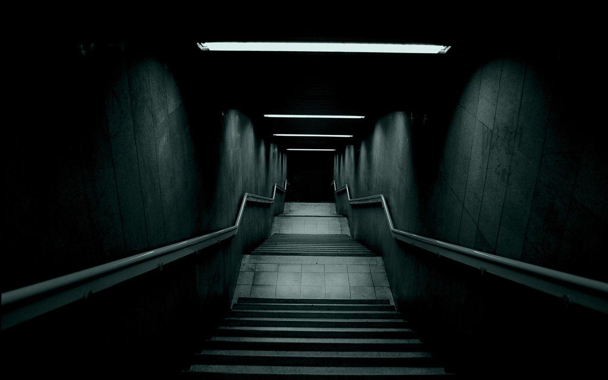

# the day code is reversed at night



```c
char A[] =
    "About me\n"
    "- nothing u need to know\n"
    "i use\n C, Python, gdb, radare2\n"
    "\nЯ обнаружил,\n"
    "что преимущество мудрости перед глупостью\n"
    "— это преимущество света перед тьмой.\n";

__attribute__((naked)) void _start() {
    __asm__(
        "lea A(%rip), %rsi\n"
        "xor %rdx,%rdx\n"
        "0:\n"
        "cmpb $0,(%rsi,%rdx)\n"
        "je 1f\n"
        "inc %rdx\n"
        "jmp 0b\n"
        "1:\n"
        "mov $1,%rax\n"
        "mov $1,%rdi\n"
        "syscall\n"
        "mov $60,%rax\n"
        "xor %rdi,%rdi\n"
        "syscall\n"
    );
    
}

```

